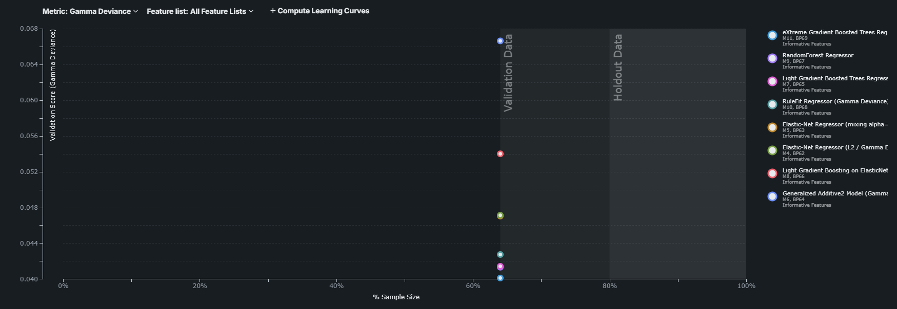

# DataRobot
## Project Overview

This project uses DataRobot to build and evaluate a machine learning model on structured tabular data. I trained the model on the California Housing dataset to predict housing prices. The model's performance was assessed using metrics like RMSE and visualized with ROC curves and learning curves. Predictions were exported and compared against test data for validation.

##  Models Trained

DataRobot automatically trained and evaluated multiple regression models on the California Housing dataset, including:

- eXtreme Gradient Boosted Trees Regressor
- RandomForest Regressor
- Light Gradient Boosted Trees Regressor
- RuleFit Regressor (Gamma Deviance)
- Elastic-Net Regressor (L2 / L1)
- LightGBM on ElasticNet
- Generalized Additive2 Model (Gamma)

Each model was evaluated using **Gamma Deviance** as the primary metric. The best-performing models had the lowest validation scores. The visual comparison of models is shown in the performance chart below:

## 📈 Learning Curve

The learning curve below shows how model performance improves with more training data. It helps visualize whether the model is underfitting, overfitting, or generalizing well.

